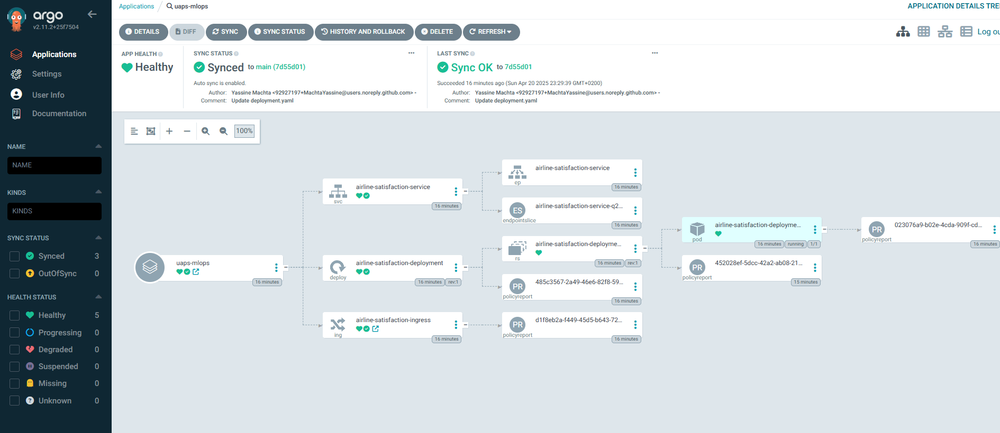

# Uncovering-airline-passenger-satisfaction

## Usage Instructions

---

## 1. Environment Setup

Install dependencies (using conda):

```bash
conda env create -f environment.yml
conda activate UAPS
```

Or with pip:

```bash
pip install -r requirements.txt
```

---

## 2. Installation

Install the package in editable mode from the project root:

```bash
pip install -e .
```

---

## 3. Data Preprocessing

Preprocess the raw data (train and test):

```bash
preprocess
```

This will create `data/processed/train_processed.csv` and `data/processed/test_processed.csv` if they do not already exist.

---

## 4. Training

Train a model (examples):

```bash
train --model-type random_forest --n-estimators 200
train --model-type logistic_regression --max-iter 300
train --model-type mlp --hidden-dim 128 --max-iter 500
train --model-type torch_nn --hidden-dim 64 --epochs 20 --lr 0.001
```

See all options:
```bash
train -h
```

---

## 5. Inference

Run inference on a trained model:

```bash
infer --experiment_id <EXPERIMENT_ID> --run_id <RUN_ID> --input_csv data/processed/test_processed.csv
```
Or use the best trained model:

```bash
infer --input_csv data/processed/test_processed.csv
```

See all options:
```bash
infer -h
```

---

## 6. MLflow Tracking (Optional)

To compare and benchmark models, launch the MLflow UI:

```bash
mlflow ui
```

Then open [http://localhost:5000](http://localhost:5000) in your browser.

---

## 7. Testing

Run tests with:

```bash
pytest tests/
```

---

## 8. API Usage (Local)

Launch the FastAPI Model API:

```bash
python api/run_api.py --experiment_id <EXPERIMENT_ID> --run_id <RUN_ID> --reload
```
Or simply:

```bash
python api/run_api.py --reload
```

- The API will be available at http://localhost:8000

### Using the API for Inference

1. **Welcome Page:**
   - Open [http://localhost:8000/](http://localhost:8000/) in your browser to see a welcome message and usage instructions.

2. **Interactive Docs:**
   - Visit [http://localhost:8000/docs](http://localhost:8000/docs) for the interactive OpenAPI UI where you can test the `/predict` endpoint.

3. **Programmatic Inference:**
   - Send a POST request to `/predict` with a CSV file containing your input data:

```bash
curl -X POST "http://localhost:8000/predict" -F "file=@data/processed/test_processed.csv"
```

### Using the API for Inference with Preprocessing

You can control whether the API should preprocess your input data before making predictions by using the `preprocess` query parameter:

```bash
curl -X POST "http://localhost:8000/predict?preprocess=true" -F "file=@data/raw/test.csv"
```

- If `preprocess=true`, the API will preprocess your raw input data before inference.
- If omitted or set to `false`, the API will use your data as-is (assumes it is already preprocessed).

---

## 9. Using the Docker Image

To pull the Docker image from Docker Hub:

```bash
docker pull ymahta/uaps:latest
```

To run the Docker image and start the API (exposes port 8000):

```bash
docker run -p 8000:8000 ymahta/uaps:latest
```

You can now access the API at [http://localhost:8000](http://localhost:8000) or use the `/predict` endpoint as follows:

```bash
curl -X POST "http://localhost:8000/predict" -F "file=@data/processed/test_processed.csv"
```


---

## 10. Using the Exposed API (Cloud)

To use the deployed API, you can send a CSV file to get predictions:

```bash
curl -X POST "https://airline-satisfaction.lab.sspcloud.fr/predict" -F "file=@data/processed/test_processed.csv"
```

---

## 11. Project Delivery Information

The main project repository is available here:
- https://github.com/rouaabl/Uncovering-airline-passenger-satisfaction

To enable automation (CI/CD) with GitHub Actions and automate Docker updates, we had to use a fork, since only repository administrators can configure the required GitHub secrets. You can view the fork containing the workflows here:
- https://github.com/MachtaYassine/Uncovering-airline-passenger-satisfaction/actions

We have also set up a dedicated repository for automation operations (Docker updates via Kubernetes and ArgoCD) and the API is deployed at this host:
- https://airline-satisfaction.lab.sspcloud.fr
- https://github.com/MachtaYassine/UAPS-Ops

---

## 12. Issues and Limitations

- **Docker Image Size**: The generated Docker image is relatively large, Compressed it at 3 gigs and 9 uncompressed. In docker hub we saw that 3 out of the 3.2GB compressed image came from pip installing packages.


---

## 13. Illustrations


### 3. Kubernetes Deployment with ArgoCD
